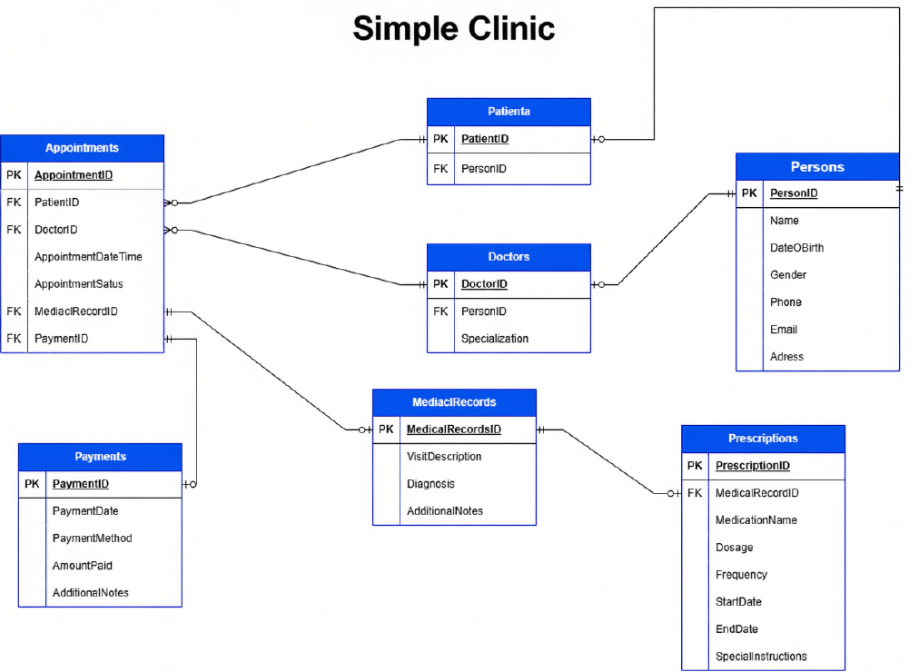
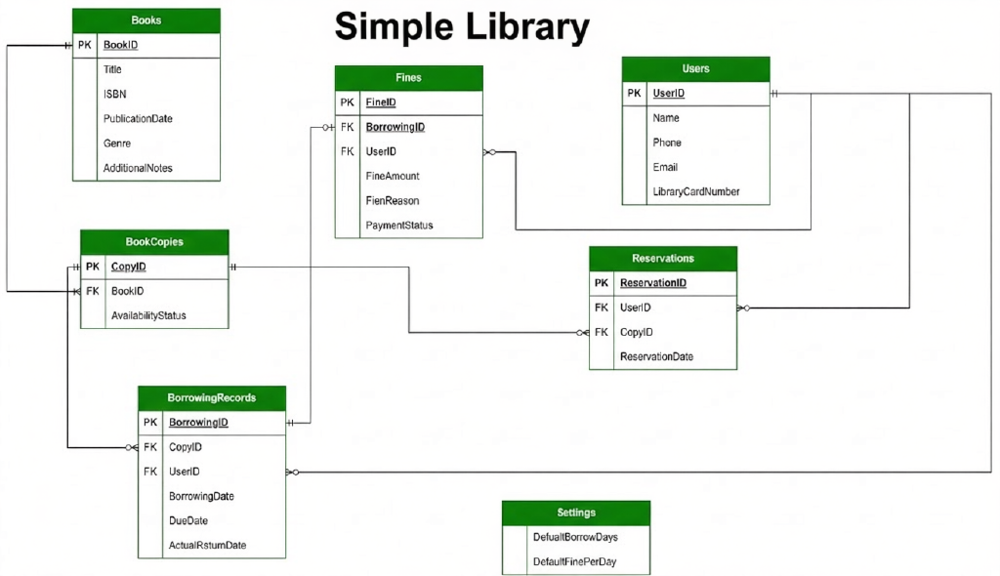
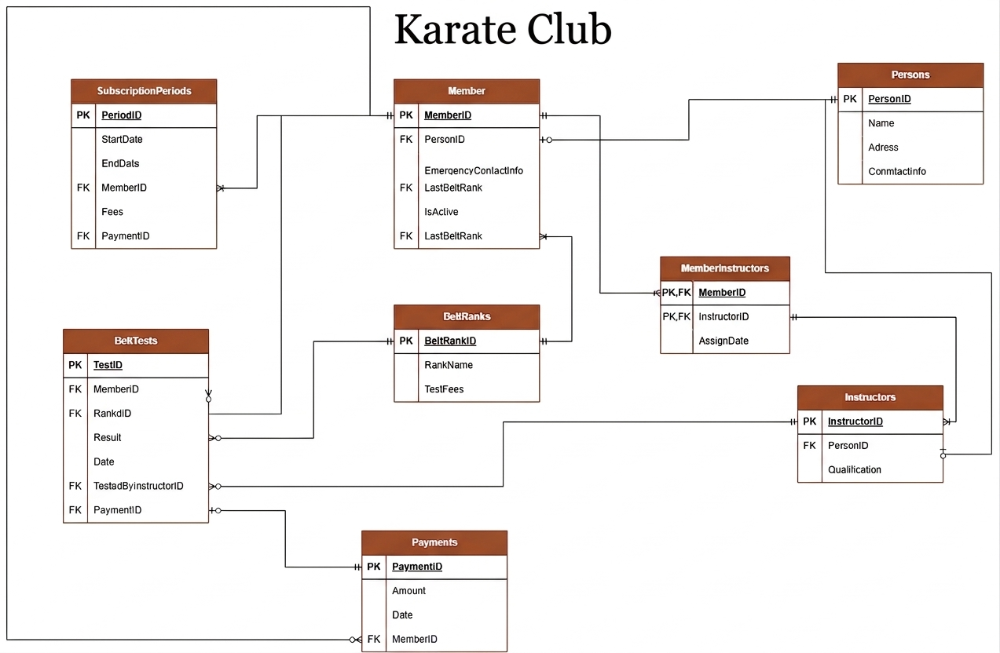
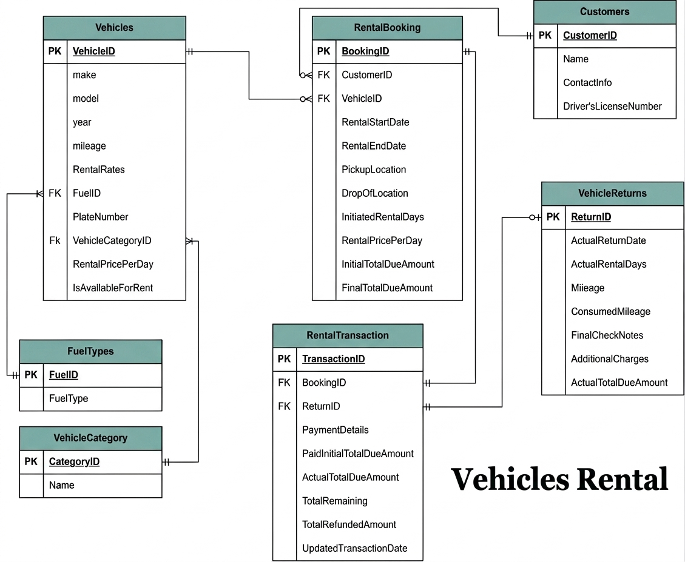
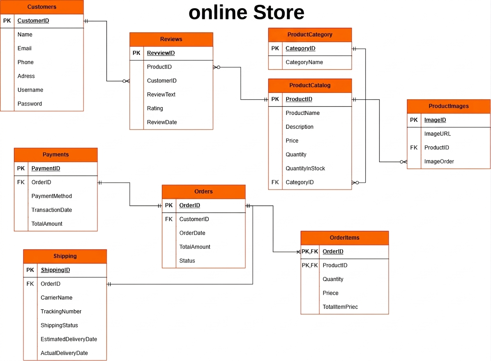

# Relational Database Design Projects

This repository contains five relational database design projects completed as part of **Course 17** in the [Programming Advices](https://programmingadvices.com/) roadmap by **Dr. Mohammed Abu-Hadhoud**.

The purpose of these projects was to practice analyzing business requirements and transforming them into structured relational database designs. Each project represents a different business domain and includes entities, attributes, primary keys, foreign keys, and relationships.

## Projects Overview

| # | Project | Domain | Main Concepts |
|---|---------|--------|---------------|
| 1 | [Simple Clinic](#1-simple-clinic) | Healthcare | Specialization, appointments, medical records, prescriptions, and payments |
| 2 | [Simple Library](#2-simple-library) | Library Management | Book copies, borrowing, reservations, fines, and availability tracking |
| 3 | [Karate Club](#3-karate-club) | Club Management | Memberships, instructors, belt ranks, tests, and payments |
| 4 | [Vehicles Rental](#4-vehicles-rental) | Vehicle Rental | Bookings, rentals, returns, mileage, and financial transactions |
| 5 | [Online Store](#5-online-store) | E-commerce | Products, categories, orders, reviews, payments, and shipping |

## Skills Practiced

- Analyzing business and system requirements
- Identifying entities and their attributes
- Defining primary and foreign keys
- Modeling one-to-one, one-to-many, and many-to-many relationships
- Resolving many-to-many relationships using junction tables
- Applying normalization to reduce redundancy
- Using denormalization and cached values when justified by business or performance needs
- Preserving data integrity through clear relationships
- Converting written requirements into relational schemas
- Modeling real-world workflows and business rules

## Project Details

### 1. Simple Clinic

A relational database design for managing the main operations of a small clinic.

The design includes:

- Shared personal information for patients and doctors
- Doctor specializations
- Patient appointments and their statuses
- Medical records and diagnoses
- Prescriptions and medication instructions
- Appointment payments

---

### 2. Simple Library

A database design for managing books, physical copies, library users, and borrowing operations.

The design includes:

- Book information and ISBN values
- Multiple physical copies of the same book
- Copy availability tracking
- Registered library users and card numbers
- Borrowing and return records
- Book reservations
- Late-return fines and payment status
- Configurable borrowing and fine settings

---

### 3. Karate Club

A database design for managing the members, instructors, subscriptions, and belt progression of a karate club.

The design includes:

- Shared personal information for members and instructors
- Membership and subscription periods
- Member–instructor assignments through a junction table
- Belt ranks and test fees
- Belt tests, results, and responsible instructors
- Member payments
- Current member status and latest belt rank

---

### 4. Vehicles Rental

A relational database design that represents the complete workflow of a vehicle rental business, from booking to return.

The design includes:

- Vehicle details, fuel types, and categories
- Vehicle availability and daily rental rates
- Customer and driver's license information
- Rental bookings and pickup/drop-off locations
- Planned and actual rental durations
- Vehicle returns, mileage, inspection notes, and additional charges
- Initial payments, final totals, remaining balances, and refunds

---

### 5. Online Store

A database design for handling the essential operations of an online store.

The design includes:

- Customer accounts and contact information
- Product catalogs and categories
- Product stock and multiple product images
- Customer reviews and ratings
- Orders and order items
- Payment information
- Shipping details, tracking numbers, and delivery statuses

The `OrderItems` junction table resolves the many-to-many relationship between orders and products while preserving the quantity and price associated with each ordered product.

## Key Learning Outcome

The most important lesson from these projects is that database design does not begin by creating tables. It begins by understanding the business domain, identifying its rules, and deciding how its data should be represented and connected.

These projects strengthened my ability to move from written requirements to clear relational designs that can later be implemented in SQL Server and integrated with C# applications.

## Tools

- Draw.io (diagrams.net)
- Relational Schema Modeling
- SQL Server concepts

## Next Steps

- Implement the schemas in SQL Server
- Add appropriate constraints and indexes
- Write SQL queries against real datasets
- Connect the databases to C# applications using ADO.NET
- Apply a 3-tier architecture in complete projects

## Author

**Majd Alzuhri**  
Software Engineering Student at Riphah International University  
Focused on backend development with C#, .NET Framework, and SQL Server

- GitHub: [MajdAlzuhri](https://github.com/MajdAlzuhri)
- LinkedIn: [Majd Alzuhri](https://www.linkedin.com/in/majd-alzuhri/)

---

If you find these projects useful, feel free to explore the repository and follow my learning journey.
